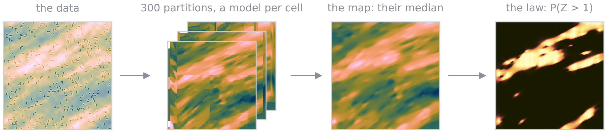

Spatialize
==========

Spatialize estimates a spatial variable by its law. At every location it returns a whole
distribution of possible values instead of a single number, the distributions at different locations coming out tied together. Questions about one place, such as the probability of exceeding a
limit, and questions about many places at once, such as an area, a block average or a simulated
field, are then answered from one coherent estimate.

The method is simple to state. Draw a random partition of the domain, fit a light local model in
each cell from the data it holds, and repeat many times. Each repetition gives one candidate field. Their collection, the ensemble, is the estimate. Its empirical law at a location is the
*predictive law*. Locations that share cells move together in the ensemble, which couples them with
a dependence of every order, beyond what a covariance can express. The theory, set out in the book
*A General Theory of Higher-Order Geostatistics* (Egaña, Díaz, Navarro and Ehrenfeld), writes the law the ensemble converges to. It also tells how to choose the partitions and the local models. The
:doc:`Theory <theory/index>` pages present it without code.

         local model in each cell, their median map and the probability of exceeding 1

Spatialize implements this approach, **Ensemble Spatial Analysis (ESA)**, as an open source Python
library with a C++ core. **Ensemble Spatial Interpolation (ESI)** builds the ensemble and reads
maps, intervals and probabilities from it. **Ensemble Spatial Simulation (ESS)** draws simulated
fields from the local laws, widened to the variability of the data. Around them sit the
hyperparameter searches, including a Pareto search between the errors of the partition and of the
local model, the posterior analysis of the data, the estimation of categorical variables, and the
spatial entropy and mutual information.

Features
------------

- Automated spatial estimation requiring minimal user intervention.
- Stochastic modelling and ensemble learning — robust, scalable, suitable for large datasets.
- Interpolation for both continuous and categorical data
- Uncertainty quantification: both point estimates and empirical posterior distributions.
- Works with gridded and non-gridded data, with built-in hyperparameter optimization.
- Implemented in Python 3.x with a C++ core for performance.
- Statistically tested for real-world use: a public suite of :doc:`conformance tests
  <scenarios/index>` holds every estimator to pre-registered geostatistical criteria.

.. _installation:

Installation
------------

.. code-block:: bash

   pip install spatialize

Python 3.10+ is required. Spatialize is tested on Linux, macOS, and Windows. Two optional extras
add the dependencies of the baselines and plots in :mod:`spatialize.evaluation`
(``pip install spatialize[evaluation]``) and of the conformance tests
(``pip install spatialize[scenarios]``).

.. _getting-started:

Getting Started
----------------

The example below interpolates scattered 2D data onto a regular grid using
ensemble spatial interpolation with an IDW local interpolator.

.. code-block:: python

   import numpy as np
   from spatialize.gs.esi import esi_griddata

   # Scattered sample data
   def f(x, y):
       return x * (1 - x) * np.cos(4 * np.pi * x) * np.sin(4 * np.pi * y ** 2) ** 2

   points = np.random.random((100, 2))
   values = f(points[:, 0], points[:, 1])
   grid_x, grid_y = np.mgrid[0:1:50j, 0:1:50j]

   # Ensemble spatial interpolation
   result = esi_griddata(points, values, (grid_x, grid_y),
                         local_interpolator="idw",
                         n_partitions=300, alpha=0.8, exponent=1.0)

   estimation = result.estimation()   # point estimates
   precision  = result.precision()    # uncertainty / error metric
   result.quick_plot()                # visualize

The :doc:`Theory <theory/index>` pages explain the method and how to choose its partitions and
local models, while the :doc:`API Reference <reference/index>` lists every function and parameter.
The :doc:`release notes <changes>` list what each version adds and which results it changes.

.. _citation:

Citation
--------

If you use Spatialize in your research, please cite:

- Egaña, Á.F., Díaz, G., Navarro, F., Maleki, M., Sánchez-Pérez, J.F. (2025). *Spatial distributional estimation via ensemble spatial analysis*. AIMS Mathematics 10(11), 26351-26388. https://doi.org/10.3934/math.20251159
- Navarro, F., Egaña, Á.F., Ehrenfeld, A., Garrido, F., Valenzuela, M.J., Sánchez-Pérez, J.F. (2026). *Spatialize v1.0: a Python/C++ library for ensemble spatial interpolation*. Geoscientific Model Development 19(10), 4633-4660. https://doi.org/10.5194/gmd-19-4633-2026
- Egaña, Á.F., Valenzuela, M.J., Maleki, M. et al. (2025). *Adaptive ensemble spatial analysis*. Scientific Reports 15, 26599. https://doi.org/10.1038/s41598-025-08844-z
- Egaña, Á.F., Navarro, F., Maleki, M., et al. (2021). *Ensemble Spatial Interpolation: A New Approach to Natural or Anthropogenic Variable Assessment*. Natural Resources Research 30(5), 3777-3793. https://doi.org/10.1007/s11053-021-09860-2

.. toctree::
   :maxdepth: 1
   :hidden:

   theory/index
   scenarios/index
   reference/index
   development/index
   changes